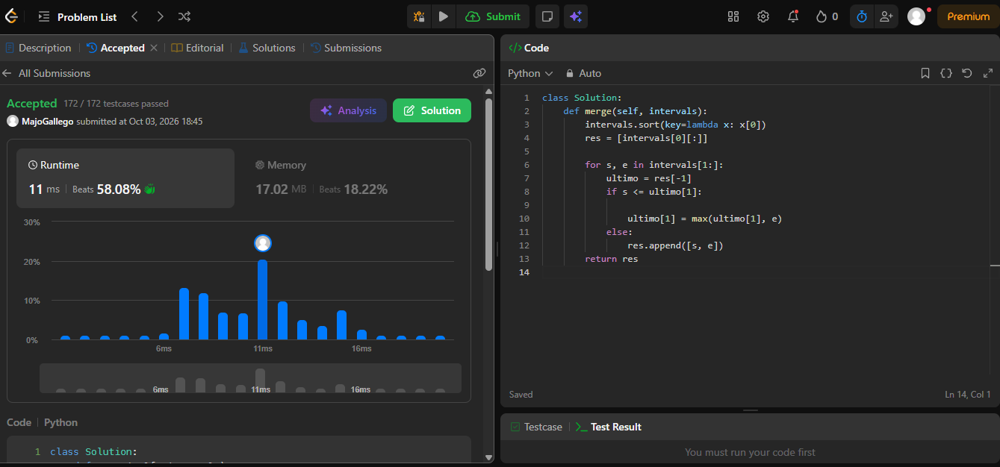
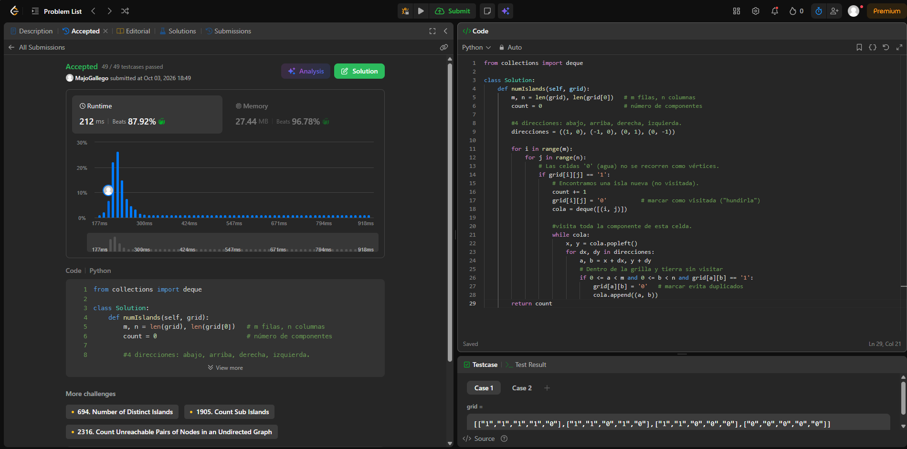
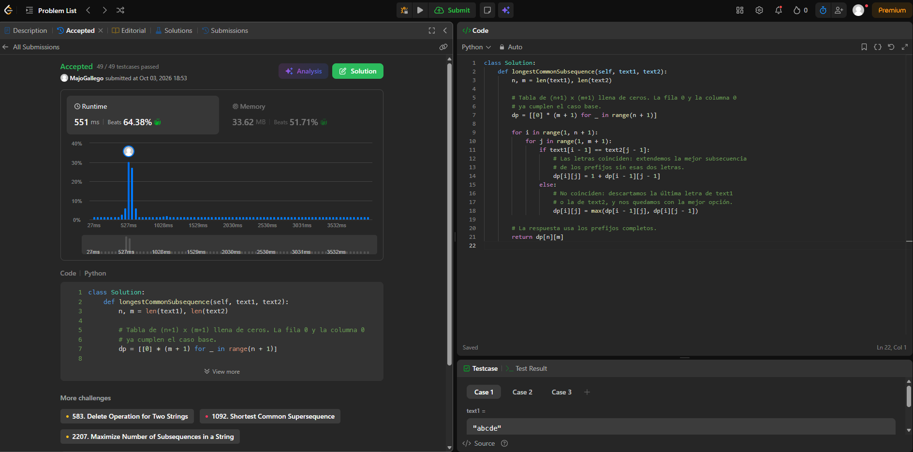
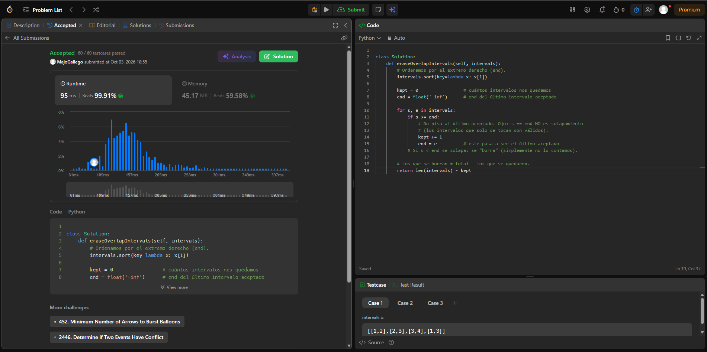
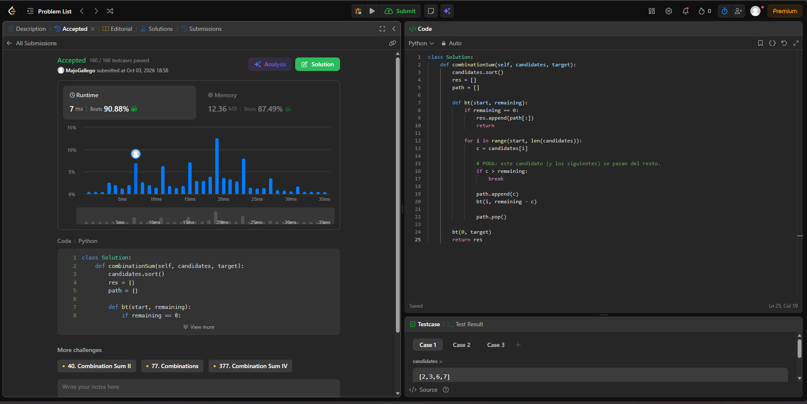

# Taller · Cinco familias en LeetCode

**Cuenta de LeetCode:** `MajoGallego`
**Lenguaje:** Python

| # | Problema | Familia | Carpeta |
|---|----------|---------|---------|
| 1 | Merge Intervals (56) | Ordenamiento | `merge-intervals/` |
| 2 | Number of Islands (200) | Grafos | `number-of-islands/` |
| 3 | Longest Common Subsequence (1143) | Programación dinámica | `longest-common-subsequence/` |
| 4 | Non-overlapping Intervals (435) | Greedy | `non-overlapping-intervals/` |
| 5 | Combination Sum (39) | Backtracking | `combination-sum/` |

---

## Ejercicio 1 · [56. Merge Intervals](https://leetcode.com/problems/merge-intervals/)

- **Código:** [`merge-intervals/merge-intervals.py`](merge-intervals/merge-intervals.py)
- **Familia:** ordenamiento.
- **Idea:** la clave es el extremo izquierdo (`start`). Se ordenan los intervalos por esa clave y se hace una pasada de izquierda a derecha manteniendo el intervalo «abierto» actual. Si el siguiente empieza antes o justo cuando termina el actual, se ensancha el `end` con `max`; si no, se cierra el actual y se abre otro.
- **Complejidad:** con `n` intervalos, tiempo **O(n log n)** (domina el sort) y espacio **O(n)** para la salida.
- **Evidencia:** 

## Ejercicio 2 · [200. Number of Islands](https://leetcode.com/problems/number-of-islands/)

- **Código:** [`number-of-islands/number-of-islands.py`](number-of-islands/number-of-islands.py)
- **Familia:** grafos.
- **Modelo:** grafo **no dirigido** implícito en la grilla. Vértice = celda `'1'`; arista = vecinas ortogonales (arriba, abajo, izquierda, derecha) que también son `'1'`, sin diagonales. Contar islas equivale a contar **componentes conexas**.
- **Idea:** se recorre la grilla y, cada vez que aparece un `'1'` no visitado, se suma 1 y se lanza un BFS que marca (hunde) toda la isla. Las celdas `'0'` no se recorren como vértices.
- **Complejidad:** con `m` filas y `n` columnas, tiempo **Θ(m·n)** (cada celda se visita una vez) y espacio **O(m·n)** en el peor caso (cola del BFS).
- **Evidencia:** 

## Ejercicio 3 · [1143. Longest Common Subsequence](https://leetcode.com/problems/longest-common-subsequence/)

- **Código:** [`longest-common-subsequence/longest-common-subsequence.py`](longest-common-subsequence/longest-common-subsequence.py)
- **Familia:** programación dinámica.
- **Estado:** `dp[i][j]` = longitud de la LCS de `text1[0..i)` y `text2[0..j)`.
- **Base:** `dp[0][j] = dp[i][0] = 0` (un prefijo vacío no comparte nada).
- **Recurrencia:**
  - si `text1[i-1] == text2[j-1]`: `dp[i][j] = 1 + dp[i-1][j-1]`;
  - si no: `dp[i][j] = max(dp[i-1][j], dp[i][j-1])`.
- **Complejidad:** con `n = len(text1)` y `m = len(text2)`, tiempo **Θ(n·m)** y espacio **Θ(n·m)** (reducible a Θ(min(n, m)) guardando solo dos filas).
- **Evidencia:** 

## Ejercicio 4 · [435. Non-overlapping Intervals](https://leetcode.com/problems/non-overlapping-intervals/)

- **Código:** [`non-overlapping-intervals/non-overlapping-intervals.py`](non-overlapping-intervals/non-overlapping-intervals.py)
- **Familia:** greedy.
- **Criterio greedy:** es la selección de actividades contada al revés. Se ordena por `end` y, entre los intervalos que aún caben, se elige el que **termina antes** (deja más espacio para los siguientes). Un intervalo se acepta si `start >= end` del último aceptado (si solo se tocan, no se solapan). La respuesta es `n - aceptados`.
- **Complejidad:** con `n` intervalos, tiempo **O(n log n)** (sort) y espacio **O(1)** extra si se ordena in-place (O(n) en Python por el sort auxiliar).
- **Evidencia:** 

## Ejercicio 5 · [39. Combination Sum](https://leetcode.com/problems/combination-sum/)

- **Código:** [`combination-sum/combination-sum.py`](combination-sum/combination-sum.py)
- **Familia:** backtracking.
- **Estado de la búsqueda:** índice desde el que se puede tomar, suma restante y combinación actual.
- **Qué se elige:** un candidato `candidates[i]`, reutilizable (la llamada recursiva sigue en `i`, no en `i+1`, para no repetir permutaciones).
- **Qué se deshace:** el último elegido (`path.pop()`) al regresar, para probar el siguiente candidato.
- **Éxito y poda:** si el resto llega a 0 se copia la combinación a la respuesta; si un candidato supera el resto, se corta la rama (`break`, con la lista ordenada).
- **Complejidad:** con `n = len(candidates)`, `t = target` y `min` el menor candidato, el peor caso es exponencial en la profundidad, tiempo **O(n^(t/min))**; espacio **O(t/min)** para la pila de recursión, más la salida.
- **Evidencia:** 
